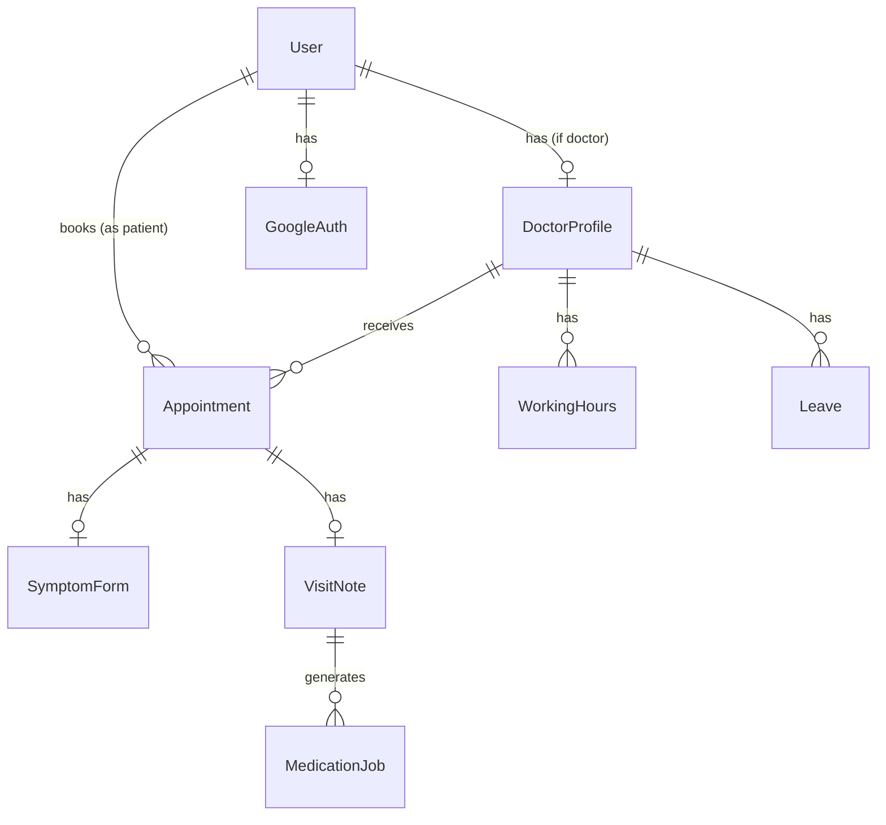

# Database Schema

> See `backend/prisma/schema.prisma` for the authoritative schema definition.

## Entity Relationship Diagram

```mermaid
erDiagram
    User ||--o| DoctorProfile : "has (if doctor)"
    User ||--o| GoogleAuth : "has"
    User ||--o{ Appointment : "books (as patient)"
    DoctorProfile ||--o{ WorkingHours : "has"
    DoctorProfile ||--o{ Leave : "has"
    DoctorProfile ||--o{ Appointment : "receives"
    Appointment ||--o| SymptomForm : "has"
    Appointment ||--o| VisitNote : "has"
    VisitNote ||--o{ MedicationJob : "generates"
```

## Tables

Details filled as models are implemented per phase.
