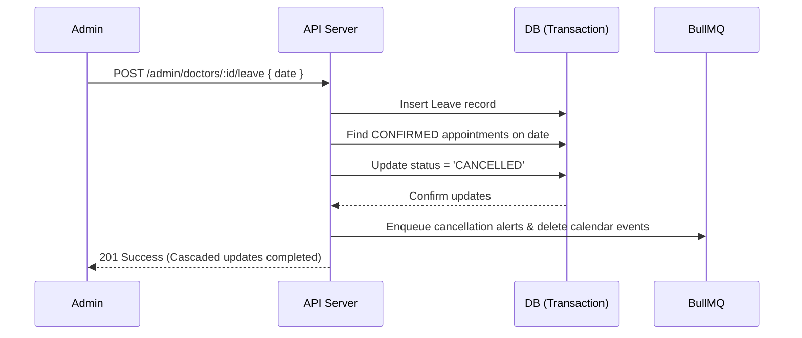

# System Design — Healthcare Appointment Manager

This document details the core architectural decisions, concurrency-safety guarantees, and reliability strategies implemented in the Healthcare Appointment and Follow-up Platform.

---

## 1. Double-Booking Prevention & Slot Holds

To prevent race conditions during concurrent booking requests, the platform relies on **database-level unique constraint indexing** rather than application-level checking.

### Concurrency Indexing
A PostgreSQL partial unique index is defined on active appointments:
```sql
CREATE UNIQUE INDEX uniq_doctor_slot_active
ON appointments (doctor_id, slot_start)
WHERE status IN ('PENDING_HOLD', 'CONFIRMED');
```
This constraint ensures that a doctor can have at most one slot reservation that is either on a pending hold or confirmed at any given time.

### Slot Hold Flow
1. **Hold Creation**: When a patient selects a slot, the system attempts to create a row in the `appointments` table with `status = 'PENDING_HOLD'` and `holdExpiresAt = now() + 5 minutes` in a transaction.
2. **Conflict Resolution**: If two patients request the same slot concurrently, PostgreSQL rejects the second transaction with a `23505` unique constraint violation. The backend catches this Prisma error and returns a clean `409 Conflict` ("Slot is already held or booked") to the second patient.
3. **Hold Expiry & Sweeper**: The held slot is locked for 5 minutes. If the patient fails to complete symptoms intake and confirm the appointment within 5 minutes, a cron job sweeps expired holds:
   ```sql
   DELETE FROM appointments
   WHERE status = 'PENDING_HOLD' AND hold_expires_at < NOW();
   ```
   Deleting the hold frees the slot immediately in the on-the-fly virtual slot generator.

---

## 2. Leave Conflict & Cascading Cancellation

When an administrator declares a leave date for a doctor, the system resolves scheduling conflicts atomically inside a database transaction:



1. **Transaction Isolation**: In a transaction, the backend inserts the `Leave` record and finds all `CONFIRMED` appointments for that doctor on the leave date.
2. **Atomic Invalidation**: The selected appointments are flipped to `status = 'CANCELLED'`.
3. **Asynchronous Side Effects**: Instead of sending emails during the request path, the backend enqueues async notification jobs (`CANCELLATION`, `LEAVE_NOTICE`) and Google Calendar deletion events to BullMQ. This prevents slow downstream APIs from blocking the administrator.
4. **Reschedule Links**: Cancelled appointments retain their original `SymptomForm` record. Patients receive a reschedule link pointing to `/patient/book?reschedule=true&appointmentId=:id`, allowing them to select a new date/time without re-filling intakes.

---

## 3. Notification Failure & Reliability Pass

Outbound communications (Email and Google Calendar synchronisation) are isolated from request handlers via BullMQ background queues.

### Job Retry Policy & Backoff
All notification jobs use a custom exponential backoff strategy:
- **Test Mode**: Delays are set to `50ms`, `100ms`, and `150ms` for rapid local feedback.
- **Production Mode**: Delays are `1 minute`, `5 minutes`, and `20 minutes` before final exhaustion.

### Idempotency Keys
To prevent duplicate emails on network retries, each notification log creates an idempotency key:
- Format: `${appointmentId}-${notificationType}-${notificationChannel}`
- If a job is retried or re-submitted, the database checks this unique key. If the notification status is `SENT` or `PENDING`, the new request is ignored.

### Dead-Letter Queue (DLQ)
When a notification job exhausts all 3 retries, the worker updates the `NotificationLog` record in the database:
- `status = 'FAILED'`
- `lastError = [Captured exception error string]`
Failed logs are rendered in the Admin Portal's dead-letters dashboard, letting administrators inspect call stacks and manually trigger retries once downstream issues are resolved.
